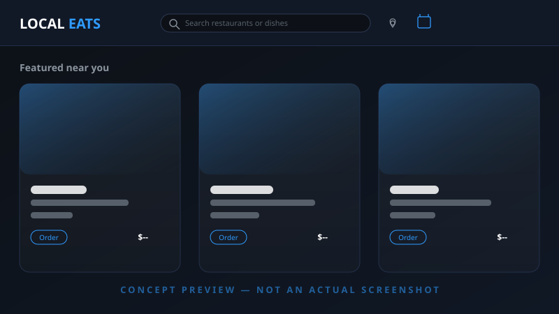
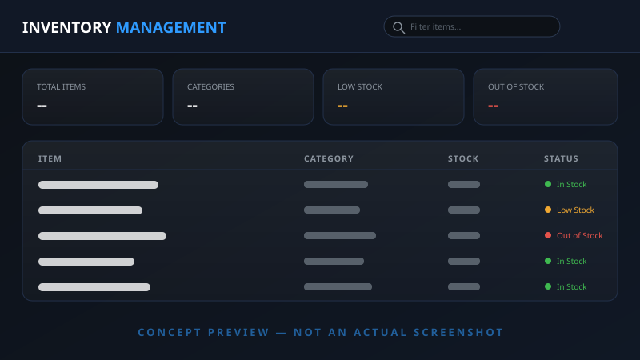
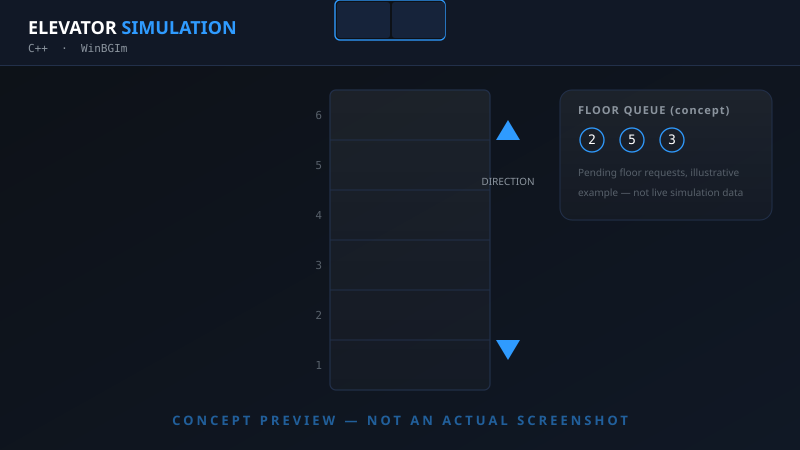
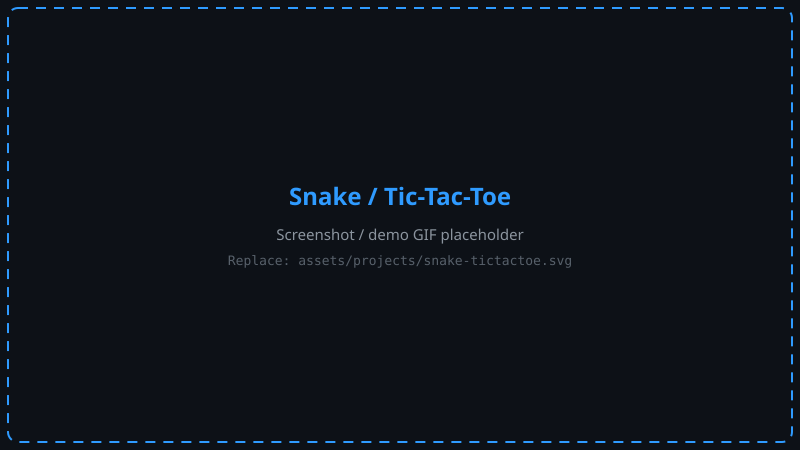
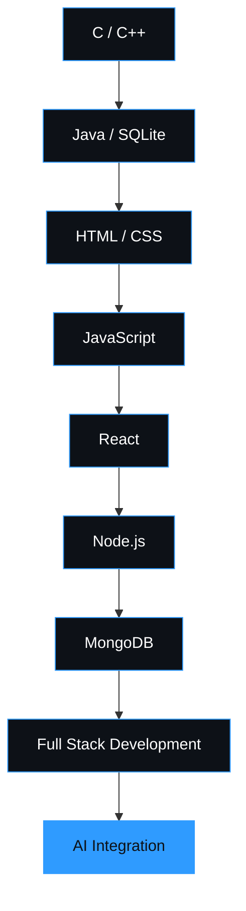

<!--
  ============================================================
  Md Shahriar Fahim — GitHub Profile README
  Repo must be named EXACTLY: mdshahriarfahim
  Sections marked "UPDATE ME" below are the ones you'll touch
  most often. Everything else (stats/streak/langs/snake) is
  live data and needs no manual editing.
  ============================================================
-->

<div align="center">

<picture>
  <source media="(prefers-color-scheme: dark)" srcset="assets/banner/hero-banner-dark.svg" />
  <source media="(prefers-color-scheme: light)" srcset="assets/banner/hero-banner-light.svg" />
  
</picture>

<p>
  <a href="https://github.com/mdshahriarfahim"></a>
  <a href="https://www.linkedin.com/in/mdshahriarfahim/"></a>
  <a href="https://www.facebook.com/msfahim34"></a>
  <a href="mailto:msfahim71291@gmail.com"></a>
</p>

<!-- External service: if this image fails to load, stats are still viewable directly on the profile -->


<sub>📍 Axvion Tech</sub>

</div>

<picture>
  <source media="(prefers-color-scheme: dark)" srcset="assets/separators/divider-dark.svg" />
  <source media="(prefers-color-scheme: light)" srcset="assets/separators/divider-light.svg" />
  
</picture>

<div align="center">

[About](#about-me) · [What I Build](#what-i-build) · [Stack](#tech-stack) · [Command Center](#developer-command-center) · [AI Lab](#ai-lab) · [Projects](#featured-projects) · [Journey](#developer-journey) · [Learning](#currently-learning) · [Roadmap](#2026-roadmap) · [Analytics](#github-analytics) · [Contact](#lets-build-something)

</div>

<br>

## About Me

I'm a CSE undergrad who spends most of his time turning ideas into working software — mostly full-stack web apps, increasingly with AI woven in. I build with **React, Node.js, and MongoDB** day-to-day, and I came up through C/C++ and Java, which is probably why I still care a lot about how things work under the hood, not just whether they run.

Right now I'm deep in modern web application patterns and figuring out how to use AI usefully — not as a gimmick bolted onto a project, but as an actual part of how software gets built and how it behaves.

Long term, I want to be the kind of full-stack developer who can take a product from a blank repo to something real people use — and increasingly, one who builds AI-native software rather than software with AI sprinkled on top.

<br>

## What I Build

| | |
|---|---|
| **Web Applications** | Responsive, user-facing apps built with React on the frontend |
| **Full Stack Systems** | End-to-end products — React + Node.js + MongoDB, from schema to UI |
| **AI-powered Applications** | Apps with AI/automation as a functional part of the product, not a bolt-on |
| **Management Systems** | Structured data-driven systems (inventory, tracking, records) |
| **Developer Tools** | Small utilities and simulations that sharpen core problem-solving |

<br>

## Current Status

<table>
<tr><td>🔨 <b>Building</b></td><td>Full-stack web applications with React, Node.js &amp; MongoDB</td></tr>
<tr><td>🤖 <b>Exploring</b></td><td>AI automation, prompt engineering, AI-powered interfaces</td></tr>
<tr><td>🧠 <b>Improving</b></td><td>System design fundamentals and clean code practices</td></tr>
</table>

<br>

## Tech Stack

**Frontend**
<br>

**Backend**
<br>

**Database**
<br>

**Programming Languages**
<br>

**Tools &amp; Environment**
<br>

<sub>Icons served by <a href="https://skillicons.dev">skillicons.dev</a> (static, no personal data, fails gracefully to a broken-image icon only — never breaks the layout).</sub>

<br>

<picture>
  <source media="(prefers-color-scheme: dark)" srcset="assets/separators/divider-dark.svg" />
  <source media="(prefers-color-scheme: light)" srcset="assets/separators/divider-light.svg" />
  
</picture>

## Developer Command Center

```
┌─────────────────────────────────────────────┐
│  SYSTEM        STATUS        MISSION         │
├─────────────────────────────────────────────┤
│  Frontend      Building      Ship            │
│  Backend       Building      Ship            │
│  Database      Stable        Maintain        │
│  AI            Exploring     Learn → Build   │
│  Tools         Stable        Maintain        │
└─────────────────────────────────────────────┘
```

<details>
<summary>💻 Terminal</summary>

```bash
$ whoami
Md Shahriar Fahim

$ role
Full Stack Developer

$ focus
Web + AI

$ mission
Build useful software
```

</details>

<br>

## AI Lab

**Experimenting with:**
- → AI automation and agentic workflows
- → AI APIs integrated into full-stack apps
- → AI-powered interfaces and assistants
- → Prompt engineering as an actual engineering discipline

<br>

<picture>
  <source media="(prefers-color-scheme: dark)" srcset="assets/separators/divider-dark.svg" />
  <source media="(prefers-color-scheme: light)" srcset="assets/separators/divider-light.svg" />
  
</picture>

## Featured Projects

**Status legend:** 🟢 Completed &nbsp;·&nbsp; 🟡 In Progress &nbsp;·&nbsp; 🔵 Learning &nbsp;·&nbsp; ⚪ Planned

<!-- UPDATE ME: swap placeholder images in assets/projects/, and fill in real repo + live demo links -->

<table>
<tr>
<td width="50%" valign="top">



### Local Eats
🟡 In Progress

Full-stack food discovery / ordering application.

**Stack:** React · Node.js · MongoDB

[Repository](https://github.com/mdshahriarfahim/local-eats) · Live Demo: *not yet deployed*

</td>
<td width="50%" valign="top">



### Inventory Management System
🟢 Completed

Inventory tracking system with persistent storage.

**Stack:** Java · SQLite

[Repository](https://github.com/mdshahriarfahim/inventory-management-system)

</td>
</tr>
<tr>
<td width="50%" valign="top">



### Elevator Simulation
🟢 Completed

Simulation of multi-elevator scheduling and request handling logic.

**Stack:** Java

[Repository](https://github.com/mdshahriarfahim/elevator-simulation)

</td>
<td width="50%" valign="top">



### Snake / Tic-Tac-Toe
🟢 Completed

Classic game logic implementations — problem solving fundamentals.

**Stack:** C++ / JavaScript

[Repository](https://github.com/mdshahriarfahim/snake-tictactoe)

</td>
</tr>
</table>

<br>

## Developer Journey



<br>

## Currently Learning

> <!-- UPDATE ME: this block is intentionally separate from the Roadmap table below — update it whenever your immediate focus shifts, without touching the longer-term roadmap. -->
> 🔵 **Right now:** Advanced React patterns (context, performance, composition) and backend architecture fundamentals.

<br>

<picture>
  <source media="(prefers-color-scheme: dark)" srcset="assets/separators/divider-dark.svg" />
  <source media="(prefers-color-scheme: light)" srcset="assets/separators/divider-light.svg" />
  
</picture>

## 2026 Roadmap

<!-- UPDATE ME: move items between statuses as they actually happen — never mark something Completed that isn't -->

| Status | Focus |
|---|---|
| 🟢 Completed | HTML, CSS, JavaScript, C/C++, Java, SQLite fundamentals |
| 🟢 Completed | React fundamentals, Node.js, MongoDB |
| 🟡 In Progress | Advanced React patterns, backend architecture, system design |
| ⚪ Planned | AI-integrated full-stack applications, authentication & deployment at scale |
| ⚪ Planned | Contributing to open source, production-grade AI tooling |

<br>

## GitHub Analytics

<div align="center">


<sub>Live data from <a href="https://github.com/anuraghazra/github-readme-stats">github-readme-stats</a>. If a card doesn't render (rare Vercel rate-limit), view stats directly at <a href="https://github.com/mdshahriarfahim">github.com/mdshahriarfahim</a>.</sub>

</div>

<br>

## Contribution Snake

<div align="center">

<picture>
  <source media="(prefers-color-scheme: dark)" srcset="https://raw.githubusercontent.com/mdshahriarfahim/mdshahriarfahim/output/github-contribution-grid-snake-dark.svg" />
  <source media="(prefers-color-scheme: light)" srcset="https://raw.githubusercontent.com/mdshahriarfahim/mdshahriarfahim/output/github-contribution-grid-snake.svg" />
  
</picture>

<sub>Generated automatically by GitHub Actions (see <code>.github/workflows/snake.yml</code>). Empty/broken until the first workflow run completes — see Setup below.</sub>

</div>

<br>

<picture>
  <source media="(prefers-color-scheme: dark)" srcset="assets/separators/divider-dark.svg" />
  <source media="(prefers-color-scheme: light)" srcset="assets/separators/divider-light.svg" />
  
</picture>

## Philosophy

<div align="center">

**BUILD. BREAK. LEARN. IMPROVE. SHIP. REPEAT.**

*"Code is not just about making things work. It's about making ideas useful."*

</div>

<br>

## Let's Build Something

Open to conversations around:
- Web Development & Full Stack Projects
- AI-powered applications
- Collaboration on open-source work

Reach out — [Email](mailto:msfahim71291@gmail.com) · [LinkedIn](https://www.linkedin.com/in/mdshahriarfahim/)

<details>
<summary>👀 Curious?</summary>
<br>
Still reading this far down? I like that. It usually means you actually check the details before shipping — that's the trait I try hardest to build in myself too.
</details>

<br>

---

<div align="center">

Thanks for visiting my profile.

[GitHub](https://github.com/mdshahriarfahim) · [LinkedIn](https://www.linkedin.com/in/mdshahriarfahim/) · [Email](mailto:msfahim71291@gmail.com)

</div>