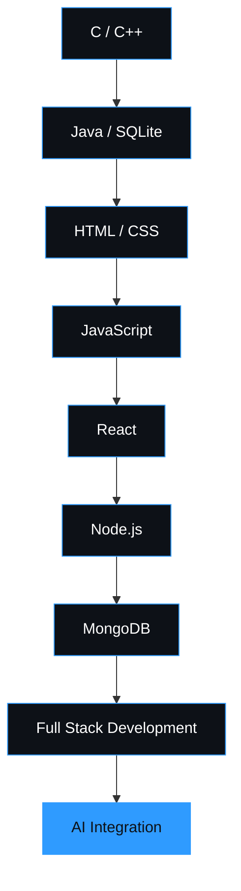

<!--
  ============================================================
  Md Shahriar Fahim — GitHub Profile README (V2)
  Repo must be named EXACTLY: mdshahriarfahim
  Sections marked "UPDATE ME" / "[ADD ...]" are the ones you'll
  touch most often. Stats/streak/langs/activity/snake are live
  data and need no manual editing.
  ============================================================
-->

<div align="center">

<picture>
  <source media="(prefers-color-scheme: dark)" srcset="assets/banner/hero-banner-dark.svg" />
  <source media="(prefers-color-scheme: light)" srcset="assets/banner/hero-banner-light.svg" />
  
</picture>

<p>
  <a href="https://github.com/mdshahriarfahim"></a>
  <a href="https://www.linkedin.com/in/mdshahriarfahim/"></a>
  <a href="https://www.facebook.com/msfahim34"></a>
  <a href="mailto:msfahim71291@gmail.com"></a>
</p>


<sub>📍 Axvion Tech</sub>

</div>

<picture>
  <source media="(prefers-color-scheme: dark)" srcset="assets/separators/divider-dark.svg" />
  <source media="(prefers-color-scheme: light)" srcset="assets/separators/divider-light.svg" />
  
</picture>

<!-- ============ PREMIUM NAVIGATION ============ -->
<div align="center">

| [`About`](#about-me) | [`Status`](#developer-status-dashboard) | [`Stack`](#tech-stack) | [`Arsenal`](#developer-arsenal) | [`Command Center`](#developer-command-center) | [`AI Lab`](#ai-lab) | [`Projects`](#featured-projects) | [`Journey`](#developer-journey) | [`Roadmap`](#2026-roadmap) | [`Analytics`](#github-analytics) | [`Achievements`](#achievements--certifications) | [`Contact`](#lets-build-something) |
|---|---|---|---|---|---|---|---|---|---|---|---|

</div>

<br>

## About Me

I'm a CSE undergrad who spends most of his time turning ideas into working software — mostly full-stack web apps, increasingly with AI woven in. I build with **React, Node.js, and MongoDB** day-to-day, and I came up through C/C++ and Java, which is probably why I still care a lot about how things work under the hood, not just whether they run.

Right now I'm deep in modern web application patterns and figuring out how to use AI usefully — not as a gimmick bolted onto a project, but as an actual part of how software gets built and how it behaves. Prompt engineering and AI automation are where a lot of my curiosity is going lately.

Long term, I want to be the kind of full-stack developer who can take a product from a blank repo to something real people use — and increasingly, one who builds AI-native software rather than software with AI sprinkled on top.

<div align="center">

| Role | Focus | Philosophy |
|---|---|---|
| Full Stack Developer · CSE Student | Web + AI | Build. Break. Learn. Improve. Ship. |

</div>

<br>

<picture>
  <source media="(prefers-color-scheme: dark)" srcset="assets/separators/divider-dark.svg" />
  <source media="(prefers-color-scheme: light)" srcset="assets/separators/divider-light.svg" />
  
</picture>

## Developer Status Dashboard

<!-- UPDATE ME: keep this current — no percentages, just plain honest state -->

| | |
|---|---|
| 🎯 **Current Focus** | Full-stack web development with React, Node.js & MongoDB |
| 🔵 **Currently Learning** | Advanced React patterns (context, performance, composition) and backend architecture fundamentals |
| 🔨 **Building** | Full-stack web applications |
| 🤖 **Exploring** | AI automation, prompt engineering, AI-powered interfaces |
| 🚀 **2026 Goal** | Ship an AI-integrated full-stack application end-to-end |

<br>

## Tech Stack

<table>
<tr><td valign="top" width="33%">

**Frontend**
<br>

</td><td valign="top" width="33%">

**Backend**
<br>

</td><td valign="top" width="33%">

**Database**
<br>

</td></tr>
<tr><td valign="top" width="33%">

**Programming Languages**
<br>

</td><td valign="top" width="33%">

**AI & Automation**
<br>
<br><sub>Prompt engineering · AI-assisted development workflows</sub>

</td><td valign="top" width="33%">

**Development Environment**
<br>

</td></tr>
</table>

<sub>Icons served by <a href="https://skillicons.dev">skillicons.dev</a> (static, fails gracefully to a broken-image icon only — never breaks layout).</sub>

<br>

## Developer Arsenal

*Same real tools as above, organized by how I actually use them day-to-day.*

<table>
<tr><td width="50%" valign="top">

**Code**
VS Code — primary editor for everything

**Version Control**
Git + GitHub — daily workflow, branching, PRs

</td><td width="50%" valign="top">

**Database**
MongoDB (app data) · SQLite (lightweight/local projects)

**AI**
Prompt engineering for planning, debugging, and AI-assisted coding workflows

</td></tr>
</table>

<br>

<picture>
  <source media="(prefers-color-scheme: dark)" srcset="assets/separators/divider-dark.svg" />
  <source media="(prefers-color-scheme: light)" srcset="assets/separators/divider-light.svg" />
  
</picture>

## Developer Command Center

┌─────────────────────────────────────────────┐
│ SYSTEM STATUS MISSION                       │
├─────────────────────────────────────────────┤
│ Frontend Building Ship                      │
│ Backend Building Ship                       │
│ Database Stable Maintain                    │
│ AI Exploring Learn → Build                  │
│ Tools Stable Maintain                       │
└─────────────────────────────────────────────┘

<details>
<summary>💻 Terminal</summary>

```bash
$ whoami
Md Shahriar Fahim

$ current-focus
Full-stack web development (React · Node.js · MongoDB)

$ tech-stack
HTML · CSS · JS · React · Node.js · MongoDB · C/C++ · Java · SQLite

$ mission
Build useful software

$ roadmap
learning → advanced-react → backend-architecture → ai-integration
```

</details>

<br>

## AI Lab

**Experimenting with:**
- → AI automation and agentic workflows
- → AI APIs integrated into full-stack apps
- → AI-powered interfaces and assistants
- → Prompt engineering as an actual engineering discipline

<sub>This is active exploration, not a claim of shipped production AI systems.</sub>

<br>

<picture>
  <source media="(prefers-color-scheme: dark)" srcset="assets/separators/divider-dark.svg" />
  <source media="(prefers-color-scheme: light)" srcset="assets/separators/divider-light.svg" />
  
</picture>

## Featured Projects

**Status legend:** 🟢 Completed &nbsp;·&nbsp; 🟡 In Progress &nbsp;·&nbsp; 🔵 Learning &nbsp;·&nbsp; ⚪ Planned
**Demo legend:** 🎬 Watch Demo &nbsp;·&nbsp; 🧪 Live Demo &nbsp;·&nbsp; ⏳ Not yet deployed

<!-- UPDATE ME: swap placeholder images for real screenshots/GIFs (same  tag works for either format), fill in [ADD KEY FEATURES], add real demo links only once they exist -->

<table>
<tr>
<td width="50%" valign="top">


### Local Eats
🟡 In Progress

Full-stack food discovery / ordering application.

**Stack:** React · Node.js · MongoDB
**Key Features:** [ADD KEY FEATURES]

[Repository](https://github.com/mdshahriarfahim/local-eats) · ⏳ Not yet deployed

</td>
<td width="50%" valign="top">


### Inventory Management System
🟢 Completed

Inventory tracking system with persistent storage.

**Stack:** Java · SQLite
**Key Features:** [ADD KEY FEATURES]

[Repository](https://github.com/mdshahriarfahim/inventory-management-system)

</td>
</tr>
<tr>
<td width="50%" valign="top">


### Elevator Simulation
🟢 Completed

Simulation of multi-elevator scheduling and request handling logic.

**Stack:** Java
**Key Features:** [ADD KEY FEATURES]

[Repository](https://github.com/mdshahriarfahim/elevator-simulation)

</td>
<td width="50%" valign="top">


### Snake / Tic-Tac-Toe
🟢 Completed

Classic game logic implementations — problem solving fundamentals.

**Stack:** C++ / JavaScript
**Key Features:** [ADD KEY FEATURES]

[Repository](https://github.com/mdshahriarfahim/snake-tictactoe)

</td>
</tr>
</table>

<br>

## Developer Journey



<br>

<picture>
  <source media="(prefers-color-scheme: dark)" srcset="assets/separators/divider-dark.svg" />
  <source media="(prefers-color-scheme: light)" srcset="assets/separators/divider-light.svg" />
  
</picture>

## 2026 Roadmap

<!-- UPDATE ME: move items between statuses as they actually happen — never mark something Completed that isn't -->

| Status | Focus |
|---|---|
| 🟢 Completed | HTML, CSS, JavaScript, C/C++, Java, SQLite fundamentals |
| 🟢 Completed | React fundamentals, Node.js, MongoDB |
| 🟡 In Progress | Advanced React patterns, backend architecture, system design |
| ⚪ Planned | AI-integrated full-stack applications, authentication & deployment at scale |
| ⚪ Planned | Contributing to open source, production-grade AI tooling |

**Direction, visualized:**

```mermaid
flowchart LR
    L[Learning] --> B[Building]
    B --> P[Projects]
    P --> FS[Full Stack]
    FS --> AI[AI Exploration]
    AI --> OS[Open Source]
    OS --> PG[Professional Growth]

    style L fill:#0d1117,stroke:#2F9BFF,color:#ffffff
    style B fill:#0d1117,stroke:#2F9BFF,color:#ffffff
    style P fill:#0d1117,stroke:#2F9BFF,color:#ffffff
    style FS fill:#0d1117,stroke:#2F9BFF,color:#ffffff
    style AI fill:#2F9BFF,stroke:#2F9BFF,color:#0d1117
    style OS fill:#0d1117,stroke:#2F9BFF,color:#ffffff
    style PG fill:#0d1117,stroke:#2F9BFF,color:#ffffff
```



<br>

## GitHub Analytics

<div align="center">


<sub>Live data from <a href="https://github.com/anuraghazra/github-readme-stats">github-readme-stats</a> and <a href="https://github.com/Ashutosh00710/github-readme-activity-graph">github-readme-activity-graph</a>. If a card doesn't render (rare rate-limit), view stats directly at <a href="https://github.com/mdshahriarfahim">github.com/mdshahriarfahim</a>.</sub>

</div>

<br>

## Contribution Snake

<div align="center">

<picture>
  <source media="(prefers-color-scheme: dark)" srcset="https://raw.githubusercontent.com/mdshahriarfahim/mdshahriarfahim/output/github-contribution-grid-snake-dark.svg" />
  <source media="(prefers-color-scheme: light)" srcset="https://raw.githubusercontent.com/mdshahriarfahim/mdshahriarfahim/output/github-contribution-grid-snake.svg" />
  
</picture>

<sub>Generated automatically by GitHub Actions (see <code>.github/workflows/snake.yml</code>). Empty/broken until the first workflow run completes.</sub>

</div>

<br>

<picture>
  <source media="(prefers-color-scheme: dark)" srcset="assets/separators/divider-dark.svg" />
  <source media="(prefers-color-scheme: light)" srcset="assets/separators/divider-light.svg" />
  
</picture>

## Achievements & Certifications

<!-- UPDATE ME: replace every [ADD ...] row below with a real certificate. Delete unused rows. Do not leave fabricated entries. -->

| Certificate / Achievement | Issuer | Date | Credential |
|---|---|---|---|
| [ADD CERTIFICATE NAME] | [ADD ISSUER] | [ADD DATE] | [ADD CREDENTIAL LINK] |
| [ADD CERTIFICATE NAME] | [ADD ISSUER] | [ADD DATE] | [ADD CREDENTIAL LINK] |
| [ADD CERTIFICATE NAME] | [ADD ISSUER] | [ADD DATE] | [ADD CREDENTIAL LINK] |

<br>

## Philosophy

<div align="center">

**BUILD. BREAK. LEARN. IMPROVE. SHIP. REPEAT.**

*"Code is not just about making things work. It's about making ideas useful."*

</div>

<br>

## Let's Build Something

Open to conversations around:
- Web Development & Full Stack Projects
- AI-powered applications
- Collaboration on open-source work

Reach out — [Email](mailto:msfahim71291@gmail.com) · [LinkedIn](https://www.linkedin.com/in/mdshahriarfahim/)

<details>
<summary>👀 Curious?</summary>
<br>
Still reading this far down? I like that. It usually means you actually check the details before shipping — that's the trait I try hardest to build in myself too.
<br><br>

```js
while (alive) {
  keepBuilding();
}
```

</details>

<br>

---

<div align="center">

Thanks for visiting my profile.

[GitHub](https://github.com/mdshahriarfahim) · [LinkedIn](https://www.linkedin.com/in/mdshahriarfahim/) · [Email](mailto:msfahim71291@gmail.com)

</div>